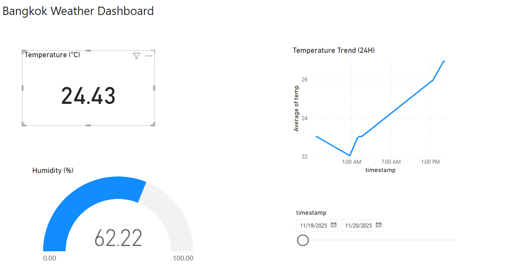

# Automated Weather Data Pipeline 

โปรเจค Data Engineering แบบ End-to-End ที่ทำการดึงข้อมูลสภาพอากาศ, จัดเก็บลง Data Warehouse และแสดงผลผ่าน Dashboard อัตโนมัติทุกวัน

##  Project Overview
ระบบนี้ถูกสร้างขึ้นเพื่อแก้ปัญหาการเก็บข้อมูลสภาพอากาศ (Historical Data) โดยระบบจะทำงานอัตโนมัติตามตารางเวลาที่กำหนด ไม่ต้องใช้คนกดรัน (Zero-touch automation)

##  Tech Stack & Tools
* **Extract:** Python (`requests`) ดึงข้อมูลจาก OpenWeatherMap API
* **Transform:** Python (`pandas`) ทำความสะอาดและจัดรูปแบบข้อมูล
* **Load:** Google BigQuery (Data Warehouse)
* **Automation:** GitHub Actions (Scheduled Cron Job)
* **Visualization:** Power BI

##  Architecture
1.  **GitHub Actions** ตื่นขึ้นมาทำงานทุกวันเวลา 07:00 น.
2.  **Python Script** ดึงข้อมูล JSON จาก API
3.  **Python Script** คัดกรองข้อมูลและแปลง Timestamp
4.  ส่งข้อมูลขึ้น **Google BigQuery** (Table: `daily_weather`)
5.  **Power BI** เชื่อมต่อกับ BigQuery เพื่อแสดงผลกราฟล่าสุด

##  Files in this Repository
* `etl_weather.py`: โค้ดหลักสำหรับทำ ETL Process
* `daily_run.yml`: ไฟล์ตั้งค่า GitHub Actions Workflow
* `weather_dashboard.pbix`: ไฟล์ Power BI Dashboard ต้นฉบับ
* `requirements.txt`: รายชื่อ Library ที่ใช้ในโปรเจค

---
*Created by Piyachoke Mevised*
